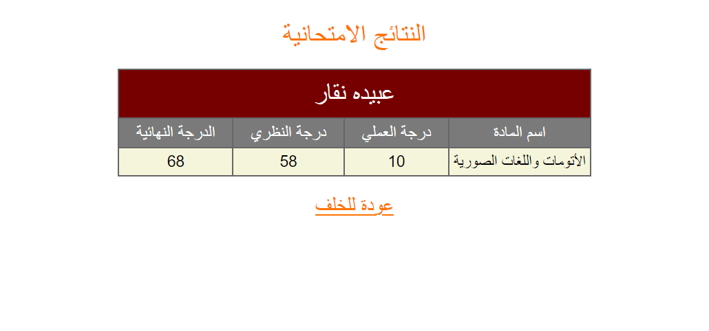
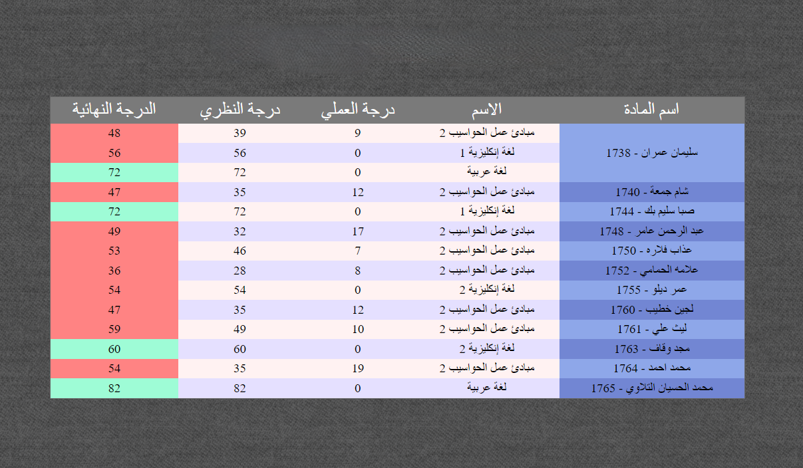

# Telegram Bot for University Marks Scraping

[](https://img.shields.io/badge/Made%20with-Python-blue.svg)
[](https://github.com/ellerbrock/open-source-badges/)
[](https://github.com/sagarlad04/telegram-university-marks-bot/blob/master/LICENSE)

This is a Telegram bot written in Python that generates an HTML file or a text message for a student's marks based on their ID number in [Albaath-Universty - IT College](https://exam.albaath-univ.edu.sy/exam-it/).

## Table of Contents

- [Telegram Bot for University Marks Scraping](#telegram-bot-for-university-marks-scraping)
  - [Table of Contents](#table-of-contents)
  - [About the Code](#about-the-code)
  - [How the bot works](#how-the-bot-works)
  - [Features](#features)
  - [Prerequisites](#prerequisites)
  - [Getting Started](#getting-started)
  - [Contributions](#contributions)
  - [License](#license)

## About the Code

This project is a modular bot, made using Python 3 and the following libraries:

- [python-telegram-bot](https://github.com/python-telegram-bot/python-telegram-bot)
- [aiohttp](https://docs.aiohttp.org/en/stable/)
- [lxml](https://lxml.de/)

## How the bot works

The bot scrapes a student marks table and converts the list of students' marks into an HTML table. For example:



The list of students' marks will look like this in HTML:



## Features

- The bot allows the user to obtain an HTML file of a single student's marks by providing their ID number using the `/html` command.
- The bot also sends a normal text message of a student's marks to the user.
- The bot allows the user to obtain HTML files of all students in a particular year using the `/year1`, `/year2`, `/year3`, `/year4`, and `/year5` commands.
- The bot can also generate an HTML file of all students whose ID numbers are within a certain range using the `/in_range` command.

## Prerequisites

Before you use this bot, you need to have:

- A working Telegram account.
- A bot token, which can be obtained by talking to [BotFather](https://telegram.me/botfather) on Telegram.

## Getting Started

1. Clone this repository to your local machine.

    ```shell
    git clone https://github.com/ObaidaNa/albaath-marks.git && cd albaath-marks
    ```

2. Add your bot token to the `config.json` file.
3. Install the required packages using the following command:

    ```shell
    pip install -r requirements.txt
    ```

4. Run the bot:

    ```shell
    python source/main.py
    ```

> **Notes:**
>
> - You can change the start message in the `config.json` file
> - Also you can specify the html file caption (when it sended to the user) and the HTML sign (which appears on the top of the HTML file)
> - To convert an HTML file to PDF, here's some websites I've tested and was working fine with Arabic:
>   - [pdfcrowd](https://pdfcrowd.com/html-to-pdf/#convert_by_upload)
>   - [web2pdfconvert](https://www.web2pdfconvert.com/html/to/pdf/)
## Contributions

If you would like to contribute to this project, feel free to submit a pull request. All contributions are welcome and appreciated!

## License

This project is licensed under the [MIT License](LICENSE).
